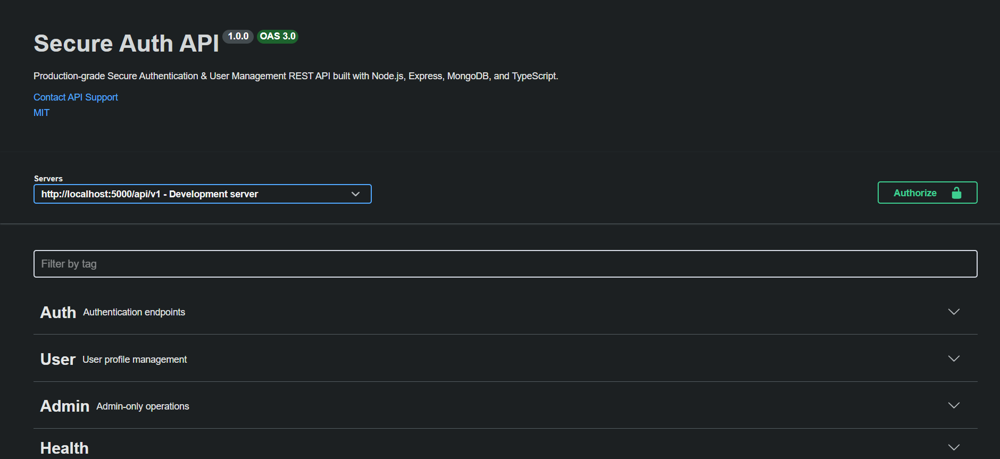
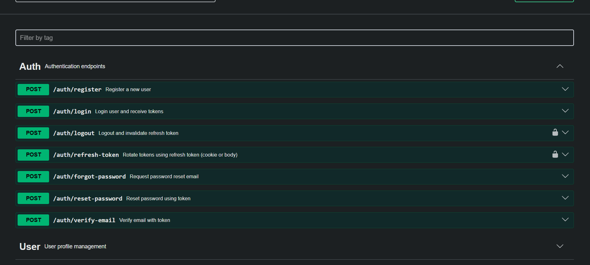
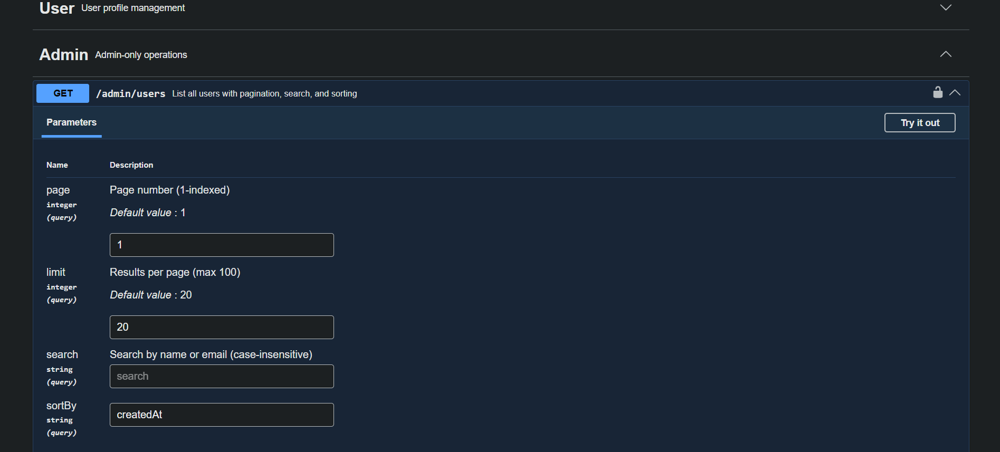

# 🔐 Secure Auth API

> A production-grade **Secure Authentication & User Management REST API** built with Node.js, Express.js, MongoDB, and TypeScript. Designed as a professional SaaS backend starter — not a tutorial project.

[](https://www.typescriptlang.org/)
[](https://nodejs.org/)
[](https://expressjs.com/)
[](https://mongoosejs.com/)
[](LICENSE)

---

## 📌 Overview

This API provides a complete authentication and user management foundation suitable for any modern web application. It implements security best practices at every layer — from password hashing and JWT rotation to rate limiting and audit logging.

**Deployment targets:** Render, Railway, or any Node.js-compatible host.

---

## ✨ Features

### 🔑 Authentication
- User registration with email verification
- Login with JWT access tokens (15-minute expiry)
- Refresh token rotation with reuse detection
- Secure logout with token invalidation
- Forgot/reset password via email
- Account lockout after N failed login attempts

### 🛡️ Security
- Passwords hashed with `bcrypt` (12 salt rounds)
- HTTP security headers via `helmet`
- CORS with configurable origins
- Per-route rate limiting (`express-rate-limit`)
- Input validation via `express-validator`
- Refresh tokens stored as SHA-256 hashes
- httpOnly cookie for refresh token delivery
- MongoDB injection prevention via Mongoose strict mode
- Environment-based configuration with startup validation

### 👤 User Management
- Role-based access control (`user` / `admin`)
- Profile fetch & update
- Admin: paginated user list with search & sort
- Admin: user deletion (with self-delete guard)

### 🏗️ Architecture
- Clean layered architecture: routes → controllers → services → models
- Centralized error handling with custom `AppError` class
- Structured logging with `winston`
- Audit trail logging for auth events
- Swagger/OpenAPI 3.0 documentation at `/api-docs`
- API versioning (`/api/v1/...`)
- Graceful shutdown with SIGTERM/SIGINT handling

---

## 📁 Project Structure

```
src/
├── config/
│   ├── database.ts        # MongoDB connection with event listeners
│   ├── env.ts             # Validated environment configuration
│   └── swagger.ts         # OpenAPI 3.0 specification
├── controllers/
│   ├── auth.controller.ts # Auth request handlers
│   └── user.controller.ts # User/admin request handlers
├── middleware/
│   ├── asyncHandler.ts    # Promise error propagation wrapper
│   ├── authenticate.ts    # JWT verification middleware
│   ├── authorize.ts       # Role-based authorization guard
│   ├── errorHandler.ts    # Global error handler + 404
│   ├── rateLimiter.ts     # Auth, forgot-password, and API limiters
│   └── validate.ts        # express-validator error formatter
├── models/
│   └── User.model.ts      # Mongoose schema with instance methods
├── routes/
│   ├── auth.routes.ts     # /auth/* endpoints with Swagger docs
│   ├── user.routes.ts     # /user/* and /admin/* endpoints
│   └── index.ts           # Versioned route aggregator + health check
├── services/
│   ├── auth.service.ts    # Authentication business logic
│   ├── email.service.ts   # Nodemailer SMTP wrapper
│   └── user.service.ts    # User management business logic
├── types/
│   └── index.ts           # Shared TypeScript interfaces & enums
├── utils/
│   ├── AppError.ts        # Custom operational error class
│   ├── audit.ts           # Structured audit event logging
│   ├── crypto.ts          # Secure token generation & hashing
│   ├── logger.ts          # Winston structured logger
│   ├── response.ts        # Standardized API response helpers
│   └── token.ts           # JWT generation & verification
├── app.ts                 # Express app factory
└── server.ts              # Server bootstrap + graceful shutdown
```

---

## 🚀 Getting Started

### Prerequisites
- Node.js >= 20.x
- MongoDB (local or MongoDB Atlas)
- npm >= 9.x

### Installation

```bash
# Clone the repository
git clone https://github.com/rishabh-kori-05/secure-auth-api.git
cd secure-auth-api

# Install dependencies
npm install

# Configure environment
cp .env.example .env
# Edit .env with your values
```

### Development

```bash
npm run dev        # Start with hot-reload (ts-node-dev)
```

### Production Build

```bash
npm run build      # Compile TypeScript → dist/
npm start          # Run compiled output
```

---

## ⚙️ Environment Variables

| Variable | Required | Default | Description |
|---|---|---|---|
| `NODE_ENV` | No | `development` | Runtime environment |
| `PORT` | No | `5000` | Server port |
| `API_VERSION` | No | `v1` | API version prefix |
| `MONGODB_URI` | **Yes** | — | MongoDB connection string |
| `JWT_ACCESS_SECRET` | **Yes** | — | Secret for access tokens (≥32 chars) |
| `JWT_REFRESH_SECRET` | **Yes** | — | Secret for refresh tokens (≥32 chars) |
| `JWT_ACCESS_EXPIRY` | No | `15m` | Access token expiry |
| `JWT_REFRESH_EXPIRY` | No | `7d` | Refresh token expiry |
| `SMTP_HOST` | No | `smtp.gmail.com` | Email SMTP host |
| `SMTP_PORT` | No | `587` | Email SMTP port |
| `SMTP_USER` | No | — | SMTP username |
| `SMTP_PASS` | No | — | SMTP password / app password |
| `EMAIL_FROM` | No | `noreply@yourapp.com` | Sender address |
| `CLIENT_URL` | No | `http://localhost:3000` | Frontend URL (for email links & CORS) |
| `BCRYPT_SALT_ROUNDS` | No | `12` | bcrypt hashing rounds |
| `MAX_LOGIN_ATTEMPTS` | No | `5` | Attempts before account lock |
| `LOCK_TIME_MINUTES` | No | `30` | Account lock duration |

---

## 📡 API Reference

All endpoints are prefixed with `/api/v1`.

### Auth Endpoints

| Method | Path | Auth | Description |
|---|---|---|---|
| `POST` | `/auth/register` | None | Register new user |
| `POST` | `/auth/login` | None | Login, receive access + refresh token |
| `POST` | `/auth/logout` | Optional | Logout, clear refresh token |
| `POST` | `/auth/refresh-token` | Cookie/Body | Rotate token pair |
| `POST` | `/auth/forgot-password` | None | Send password reset email |
| `POST` | `/auth/reset-password` | None | Reset password with token |
| `POST` | `/auth/verify-email` | None | Verify email with token |
| `GET` | `/health` | None | Health check |

### User Endpoints

| Method | Path | Auth | Description |
|---|---|---|---|
| `GET` | `/user/profile` | Bearer | Get current user profile |
| `PUT` | `/user/profile` | Bearer | Update current user profile |

### Admin Endpoints

| Method | Path | Auth | Role |
|---|---|---|---|
| `GET` | `/admin/users` | Bearer | `admin` — list users (paginated) |
| `DELETE` | `/admin/users/:id` | Bearer | `admin` — delete user |

### Response Format

All responses follow a consistent envelope:

```json
{
  "success": true,
  "message": "Operation successful",
  "data": { ... },
  "meta": {
    "total": 100,
    "page": 1,
    "limit": 20,
    "totalPages": 5,
    "hasNextPage": true,
    "hasPrevPage": false
  }
}
```

Error responses:

```json
{
  "success": false,
  "message": "Validation failed",
  "errors": [
    { "field": "email", "message": "Invalid email format" }
  ]
}
```

---

## 📚 Swagger Documentation

Interactive API docs available at:

```
http://localhost:5000/api-docs
```

Raw OpenAPI spec (JSON):
```
http://localhost:5000/api-docs.json
```

---

## 🔐 Security Architecture

### Token Strategy
- **Access Token** — short-lived JWT (15 min), sent as `Authorization: Bearer <token>`
- **Refresh Token** — long-lived JWT (7 days), delivered via `httpOnly` + `Secure` cookie; stored as SHA-256 hash in DB

### Refresh Token Rotation
On each `/auth/refresh-token` call:
1. Incoming token is verified and matched against the stored hash
2. A new token pair is issued
3. The new refresh token hash replaces the old one
4. If the old token is reused (hash mismatch), the session is immediately invalidated

### Account Lockout
After `MAX_LOGIN_ATTEMPTS` consecutive failures, the account is locked for `LOCK_TIME_MINUTES`. The lock auto-expires and resets on next successful login.

### Rate Limiting
| Route | Window | Max Requests |
|---|---|---|
| Auth routes | 15 min | 10 |
| Forgot password | 1 hour | 3 |
| All API routes | 1 min | 60 |

---

## 🚢 Deployment

### Render

1. Connect your GitHub repo in the Render dashboard
2. Use the included `render.yaml` for auto-configuration
3. Set secret environment variables in the Render dashboard

```bash
# Or deploy via Render CLI
render deploy
```

### Railway

1. Connect your GitHub repo in Railway
2. The `railway.json` config is auto-detected
3. Set environment variables via Railway dashboard or CLI:

```bash
railway variables set MONGODB_URI="..." JWT_ACCESS_SECRET="..."
railway up
```

### Environment Recommendations (Production)
- Use MongoDB Atlas (free tier works) for managed DB
- Set `NODE_ENV=production` for hardened error responses
- Use a dedicated SMTP service (SendGrid, Resend, Mailgun)
- Generate secrets with `openssl rand -hex 32`

---

## 📸 Screenshots

### Swagger Documentation



---

### Auth API 



---

### ADMIN 




---

## 🧰 Tech Stack

| Layer | Technology |
|---|---|
| Runtime | Node.js 20+ |
| Framework | Express.js 4.x |
| Language | TypeScript 5.x |
| Database | MongoDB + Mongoose 8.x |
| Auth | JWT (jsonwebtoken) |
| Hashing | bcryptjs |
| Validation | express-validator |
| Security | helmet, cors, express-rate-limit |
| Email | Nodemailer |
| Logging | Winston |
| Docs | Swagger UI + swagger-jsdoc |
| Dev | ts-node-dev |

---

## 📄 License

MIT © [Rishabh Kori](https://github.com/rishabh-kori-05)
